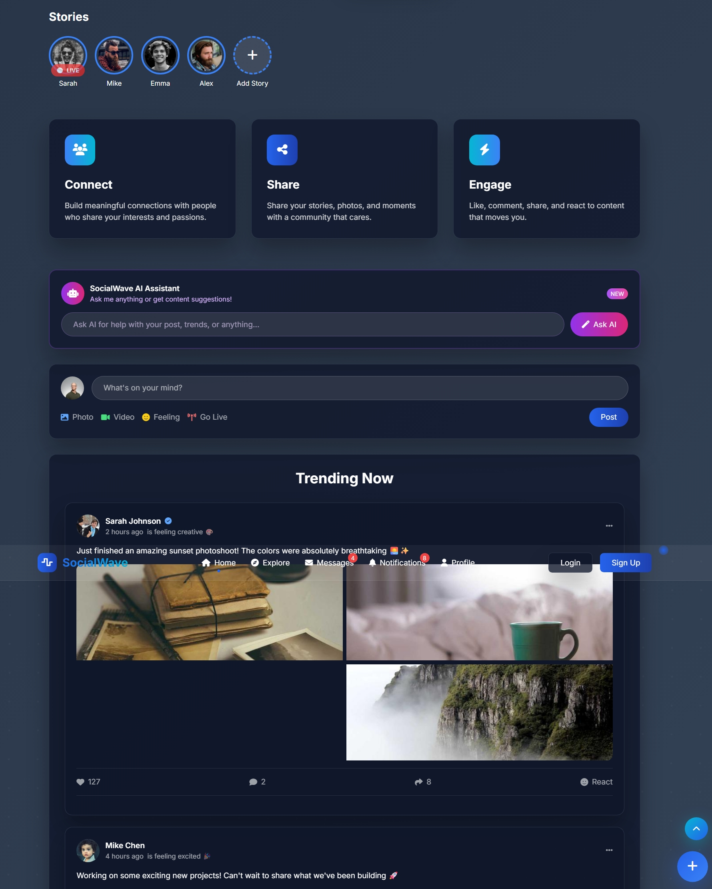
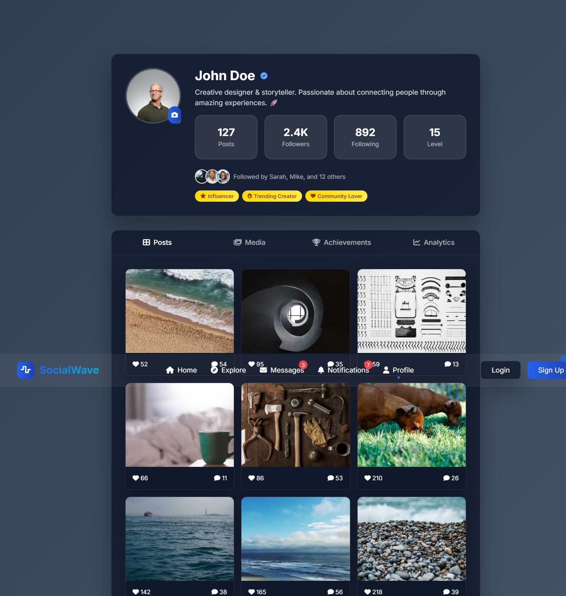
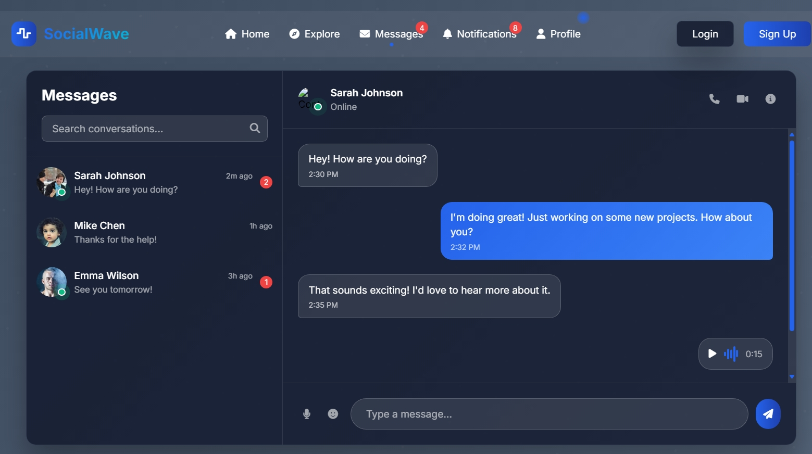
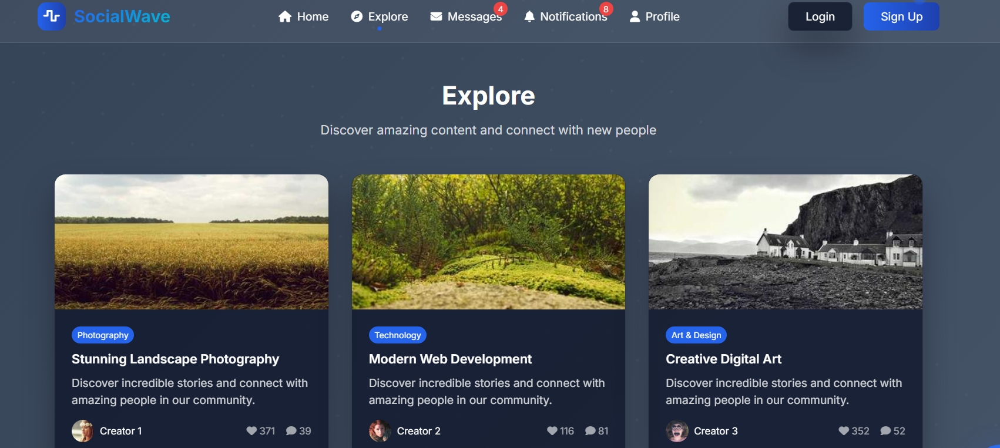
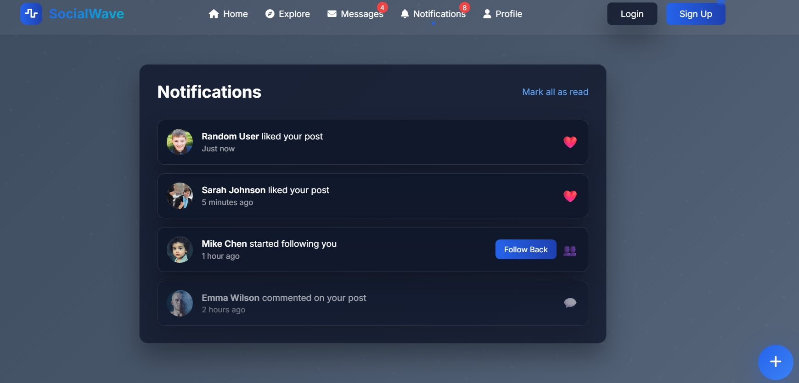
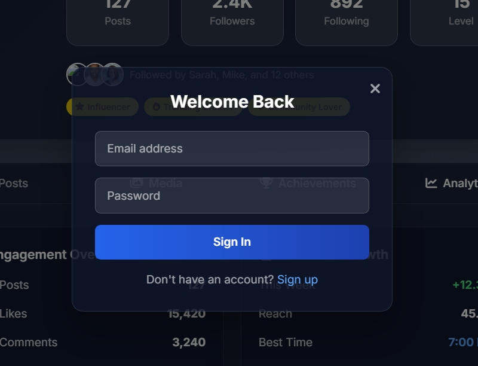
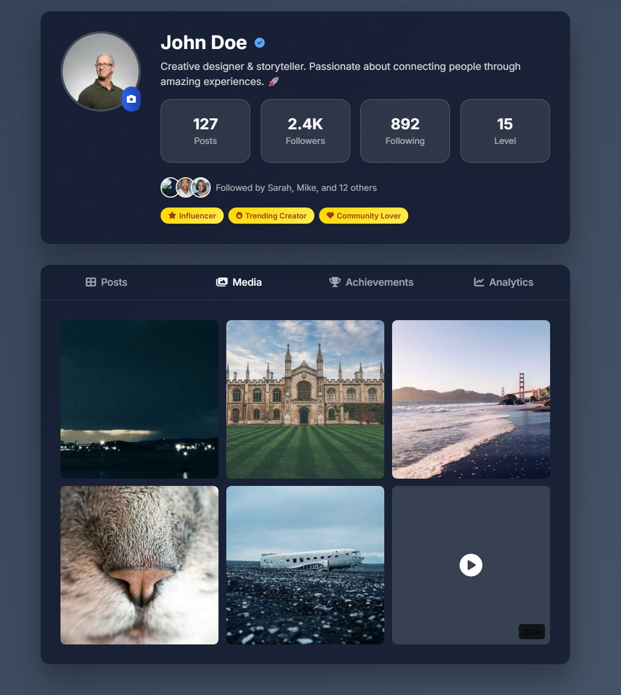

# SocialWave - Modern Social Media Platform

**Author:** Srusti  
**Version:** 1.1.0  
**License:** Proprietary (Personal Use Only)

A feature-rich, modern social media platform built with cutting-edge web technologies. SocialWave offers multiple design variations and a complete backend infrastructure for a full social media experience.

## Demo Video

<video width="100%" controls>
  <source src="backend/project_demo/DEMO.mp4" type="video/mp4">
  Your browser does not support the video tag.
</video>

*Complete demo showcasing all features and design variations check - backend/project_demo/DEMO.mp4 *

## Screenshots

### Homepage - Main Design


### Profile Page


### Messages & Chat


### Explore Section


### Notifications


### User Authentication



### Media Gallery


### Analytics Dashboard


### Achievements System


### Post Creation


## Features

### Multiple Design Variations
- **`index.html`** - Main premium design with advanced animations and glassmorphism effects
- **`index0.html`** - Simple, clean design focused on core functionality
- **`index01.html`** - Profile-focused design with enhanced user experience
- **`working.html`** - Minimal working version for testing

### Core Functionality
- User Authentication - Secure login/signup with JWT tokens
- Post Creation - Rich text posts with image/video support
- Real-time Interactions - Like, comment, share with instant feedback
- Stories Feature - Instagram-style stories with progress indicators
- Live Streaming - Go live functionality with viewer count
- Direct Messaging - Real-time chat with typing indicators
- Notifications - Smart notification system with badges
- Profile Management - Comprehensive user profiles with analytics

### Advanced Features
- AI Assistant - Built-in AI for content suggestions and help
- Voice Messages - Audio message support in chat
- Photo Lightbox - Full-screen image viewing experience
- Infinite Scroll - Seamless content loading
- Mood Selector - Express feelings with posts
- Achievement System - Gamification with badges and levels
- Analytics Dashboard - Detailed engagement metrics
- Theme Toggle - Dark/light mode support
- Responsive Design - Mobile-first approach

## Technology Stack

### Frontend
- HTML5 - Semantic markup
- CSS3 - Advanced animations, glassmorphism, custom scrollbars
- JavaScript (ES6+) - Modern vanilla JavaScript
- Tailwind CSS - Utility-first CSS framework
- Font Awesome - Icon library

### Backend
- Node.js - Runtime environment
- Express.js - Web application framework
- MongoDB - NoSQL database with Mongoose ODM
- JWT - JSON Web Tokens for authentication
- Socket.io - Real-time communication
- Multer - File upload handling
- Sharp - Image processing

### Security & Performance
- Helmet - Security headers
- Rate Limiting - API protection
- Compression - Response compression
- CORS - Cross-origin resource sharing
- bcryptjs - Password hashing
- Express Validator - Input validation

## Project Structure

```
social-media-app/
├── frontend/
│   ├── index.html          # Main premium design
│   ├── index0.html         # Simple clean design
│   ├── index01.html        # Profile-focused design
│   ├── working.html        # Minimal working version
│   ├── js/
│   │   ├── social-features.js  # Isolated social functionality
│   │   ├── main.js         # Core JavaScript
│   │   ├── auth.js         # Authentication logic
│   │   ├── posts.js        # Post management
│   │   └── profile.js      # Profile functionality
│   └── css/
│       └── styles.css      # Additional styles
├── backend/
│   ├── server.js           # Main server file
│   ├── models/             # Database models
│   ├── controllers/        # Route controllers
│   ├── middleware/         # Custom middleware
│   ├── routes/             # API routes
│   ├── Screenshots/        # Project screenshots
│   └── project_demo/       # Demo video
├── .env                    # Environment variables
├── package.json           # Dependencies
└── README.md              # This file
```

## Quick Start

### Prerequisites
- Node.js (v14 or higher)
- MongoDB (local or Atlas)
- Git

### Installation

1. Clone the repository
   ```bash
   git clone https://github.com/srusti/social-media-app.git
   cd social-media-app
   ```

2. Install dependencies
   ```bash
   # Install backend dependencies
   cd backend
   npm install
   
   # Return to root directory
   cd ..
   ```

3. Environment Setup
   ```bash
   # Copy environment file
   cp backend/.env.example backend/.env
   
   # Edit .env with your configurations
   # - MongoDB connection string
   # - JWT secrets
   # - Email credentials (optional)
   ```

4. Start the application
   ```bash
   # Start backend server
   cd backend
   npm start
   
   # Open frontend in browser
   # Navigate to frontend/index.html
   ```

### Alternative Quick Start
```bash
# Use the provided batch file (Windows)
start.bat
```

## Usage Guide

### Design Variations

#### Main Design (`index.html`)
- Best for: Production use, showcasing advanced features
- Features: Full glassmorphism UI, advanced animations, AI assistant
- Use case: Complete social media experience

#### Simple Design (`index0.html`)
- Best for: Learning, basic functionality testing
- Features: Clean interface, core social features
- Use case: Educational purposes, minimal setup

#### Profile Design (`index01.html`)
- Best for: Profile-centric applications
- Features: Enhanced profile view, achievements, analytics
- Use case: Portfolio sites, professional networks

#### Working Version (`working.html`)
- Best for: Quick testing, development
- Features: Guaranteed working like/comment/post functionality
- Use case: Feature testing, debugging

### Key Features Usage

#### Creating Posts
1. Click the floating "+" button or "What's on your mind?"
2. Add text content and/or images
3. Select mood (optional)
4. Choose privacy settings
5. Click "Post"

#### Interacting with Posts
- Like: Click the heart icon
- Comment: Click comment icon, type, and press Enter
- Share: Click share icon for sharing options

#### Stories
- Click "+" to add your story
- View others' stories by clicking their profile pictures
- Stories auto-advance with progress indicators

#### Live Streaming
1. Click "Go Live" button
2. Set stream title and description
3. Configure settings
4. Start broadcasting

## Configuration

### Environment Variables
```env
# Database
MONGODB_URI=mongodb://localhost:27017/socialwave

# Authentication
JWT_SECRET=your-secret-key
JWT_REFRESH_SECRET=your-refresh-secret

# Server
PORT=5006
NODE_ENV=development

# Email (Optional)
EMAIL_USER=your-email@gmail.com
EMAIL_PASS=your-app-password

# Frontend
FRONTEND_URL=http://localhost:3000
```

### MongoDB Setup
1. Local MongoDB:
   ```bash
   # Install MongoDB Community Edition
   # Start MongoDB service
   mongod --dbpath /path/to/data/directory
   ```

2. MongoDB Atlas (Cloud):
   - Create account at mongodb.com
   - Create cluster and get connection string
   - Add to MONGODB_URI in .env

## Customization

### Themes
- Modify CSS variables in the `:root` selector
- Update color schemes in Tailwind configuration
- Add new theme variants in JavaScript

### Features
- Add new post types in `posts.js`
- Extend user profiles in `profile.js`
- Create custom middleware in `backend/middleware/`

### UI Components
- Glassmorphism effects in CSS
- Animation keyframes for interactions
- Responsive breakpoints for mobile

## Mobile Responsiveness

- Breakpoints: Mobile-first design with Tailwind CSS
- Touch Interactions: Optimized for touch devices
- Performance: Lazy loading and optimized images
- PWA Ready: Service worker compatible

## Security Features

- Authentication: JWT-based secure authentication
- Input Validation: Server-side validation for all inputs
- Rate Limiting: API endpoint protection
- CORS: Configured cross-origin policies
- Helmet: Security headers implementation
- Password Hashing: bcrypt for secure password storage

## Performance Optimizations

- Image Optimization: Sharp for image processing
- Compression: Gzip compression for responses
- Caching: Strategic caching implementation
- Lazy Loading: Images and content lazy loading
- Minification: CSS and JS optimization

## License

**IMPORTANT: This project is under a Proprietary License**

- Personal Use: Allowed for learning 
- Commercial Use: Not permitted without explicit written permission
- Distribution: Cannot distribute, sell, or sublicense
- Modification: Cannot modify without permission

**For commercial licensing or permissions, contact:** 1nt23ad052.srusti@nmit.ac.in

See the [LICENSE](LICENSE) file for complete terms and conditions.

## Contributing

1. Fork the repository
2. Create feature branch (`git checkout -b feature/AmazingFeature`)
3. Commit changes (`git commit -m 'Add AmazingFeature'`)
4. Push to branch (`git push origin feature/AmazingFeature`)
5. Open Pull Request

## License

This project is licensed under the MIT License - see the [LICENSE](LICENSE) file for details.

## Author

**Srusti**
- GitHub: [@Srusti-26](https://github.com/Srusti-26)
- Email: 1nt23ad052.srusti@nmit.ac.in

## Acknowledgments

- Font Awesome for icons
- Tailwind CSS for styling framework
- Unsplash for demo images
- MongoDB for database solution
- Express.js community for backend framework

## Support

For support, email 1nt23ad052.srusti@nmit.ac.in or create an issue on GitHub.

---

 **⭐ this repository if you found it helpful!** 

*Built with ❤️ by Srusti*
